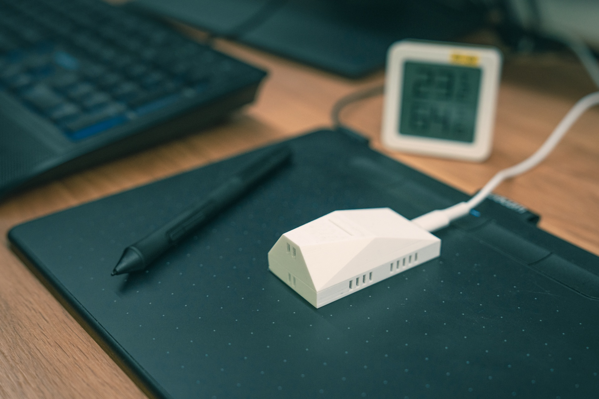
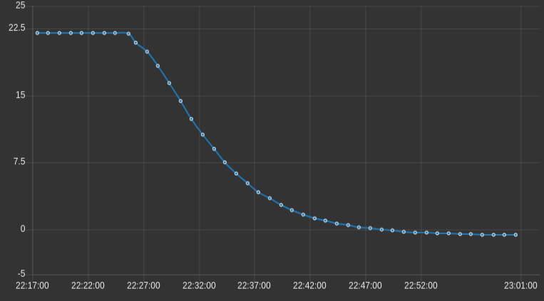
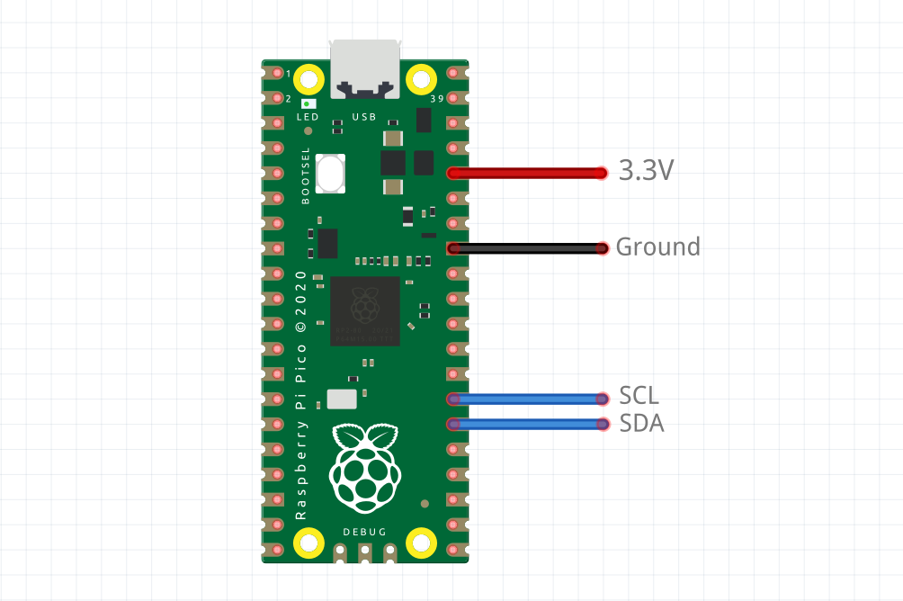

# Library for Raspberry Pico W with CircuitPython and different sensors

To measure the temperatures of individual rooms,, I decided to create my own solution by implementing temperature sensors with a Raspberry Pico W, CircuitPython and MQTT.

## Introduction
This library serves as a wrapper for the standard circuitpython libraries. Since I like simple and readable main.py (code.py), I decided to create my own standard library wrapper. During development I tried several different sensors such as BME280, SHT41, DS18B20, SGP30 and BME680 which I ended up sticking with. I also tested the SSD1306 display.

## BME680 Box and temperature compensation:

For the sensor BME680 I designed this [box](https://www.printables.com/model/431150-raspberry-pico-w-bme680) and for the SHT41 or similar this [box](https://www.printables.com/model/431152-raspberry-pico-w-sensor-box). 



After printing the boxes, I processed them by sanding under water to make the contact surfaces as precise as possible and also for the sake of design. When developing the boxes, I focused on sufficient heat dissipation from the Raspberry Pico's processor and wifi, because whether we like it or not, the Pico gets quite hot and this affects the resulting temperature measurement.

After extensive tests and making five boxes with BME680, I finally added a linear function to the script to calculate the temperature compensation difference. The reading of the normal offset from the unmeasured value was insufficient for me, because depending on the cooling efficiency of the Raspberry Pico and other components, the measured values of the temperatures from the surrounding environment weren’t close enough to the reference values made by a different thermometer. For the reference temperature values, I used a digital thermometer calibrated by a verified laboratory.

To set up the linear function, I recommend making your own measurements. The values from the example may not be valid for your box or for your 3d printing of boxes. I recommend measuring separately for each box, the results may vary slightly. The result depends both on the design of the box itself, on its processing, and on the layout of the components. After initial start-up, let the sensor run for at least 24-48 hours. Then, for each measurement, leave the sensor in the measured environment for at least 30-50 minutes to establish all temperatures in the vicinity of the calibrated meter as shown in the following picture.



Any ideas and PR are welcome.

## MQTT

The measurement results are published via MQTT. If you have a Raspberry Pico W connected via [Thonny](https://thonny.org/), you can turn on the ```debug=True``` mod for the library and the results will be displayed in the console.

MQTT has two modes here. The publisher sent the measured values to the topic set in the configuration file in the `MQTT_PUB_TOPIC` constant.
The second subscriber mode is optional when creating the ```mqtt = hx_mqtt.mqtt(subscriber=True)``` library. The built-in subscriber currently has two functions:
- `"status"` - returns to the topic in the constants `MQTT_SUB_TOPIC RAM` values, HDD Free, RAM free, IP address, MAC address, etc.
- `"restart"` - restarts the device.

Calling these functions is simple. In MQTT broker topic defined in `MQTT_SUB_TOPIC` send payload "restart" or "status".

## How to begin

- Configure settings.toml and remember that MQTT_SUB_TOPIC must be different from MQTT_PUB_TOPIC

- Install adafruit libraries (for BME680 sensor):
```
circup install adafruit_ntp
circup install adafruit_bme680
circup install adafruit_bus_device
circup install adafruit_minimqtt
```
- Compile the libraries you will use. It's really simple. More help on how to do this can be found in [lib/hexim](./lib/hexim). Then copy the *.mpy files on the raspberry pico to the /lib/hexim directory
- Patience when measuring reference values for the linear function and calibration

## SGP30

The wrapper for SGP30 is also worth mentioning, where I solved the saving and reinitialization of values for eCO2 and TVOC. This is solved by saving the values in the file in time frames according to the specification, where the first value is saved after twelve hours and the next one every hour, with the fact that the values saved in the file are valid for one week. For this method, the boot.py file must also be copied to the root directory of the Raspberry Pico in order to be able to write to the file.

## Wiring



## Conclusion

I spent several tens of hours developing and subsequently testing this solution. Therefore, if you use the script or the box yourself, or if you just like it, I will be grateful for your support.

<a href="https://www.buymeacoffee.com/heximcz" target="_blank"></a>

## Sources

- [MQTT](https://github.com/adafruit/Adafruit_CircuitPython_MiniMQTT)
- [WiFi](https://learn.adafruit.com/pico-w-wifi-with-circuitpython/pico-w-basic-wifi-test)
- [BME280](https://github.com/adafruit/Adafruit_CircuitPython_BME280)
- [BME680](https://github.com/adafruit/Adafruit_CircuitPython_BME680)
- [SHT41](https://www.rp2040learning.com/code/circuitpython/raspberry-pi-pico-and-sht40-sensor-circuitpython-example.php)
- [SGP30](https://github.com/adafruit/Adafruit_CircuitPython_SGP30)
- [SSD1306](https://github.com/adafruit/Adafruit_CircuitPython_DisplayIO_SSD1306)
- [DS18B20](https://how2electronics.com/interfacing-ds18b20-sensor-with-raspberry-pi-pico/)
- [Display Text](https://github.com/adafruit/Adafruit_CircuitPython_Display_Text)
- [Flash nuke](https://learn.adafruit.com/pico-w-wifi-with-circuitpython/installing-circuitpython)
- [Tricks](https://github.com/todbot/circuitpython-tricks)

## License

Author: Lubomir Spacek

The MIT License (MIT)
Copyright (c) 2023 by Lubomir Spacek

Permission is hereby granted, free of charge, to any person obtaining a copy of this software and associated documentation files (the "Software"), to deal in the Software without restriction, including without limitation the rights to use, copy, modify, merge, publish, distribute, sublicense, and/or sell copies of the Software, and to permit persons to whom the Software is furnished to do so, subject to the following conditions:

The above copyright notice and this permission notice shall be included in all copies or substantial portions of the Software.

THE SOFTWARE IS PROVIDED "AS IS", WITHOUT WARRANTY OF ANY KIND, EXPRESS OR IMPLIED, INCLUDING BUT NOT LIMITED TO THE WARRANTIES OF MERCHANTABILITY, FITNESS FOR A PARTICULAR PURPOSE AND NON-INFRINGEMENT. IN NO EVENT SHALL THE AUTHORS OR COPYRIGHT HOLDERS BE LIABLE FOR ANY CLAIM, DAMAGES OR OTHER LIABILITY, WHETHER IN AN ACTION OF CONTRACT, TORT OR OTHERWISE, ARISING FROM, OUT OF OR IN CONNECTION WITH THE SOFTWARE OR THE USE OR OTHER DEALINGS IN THE SOFTWARE.